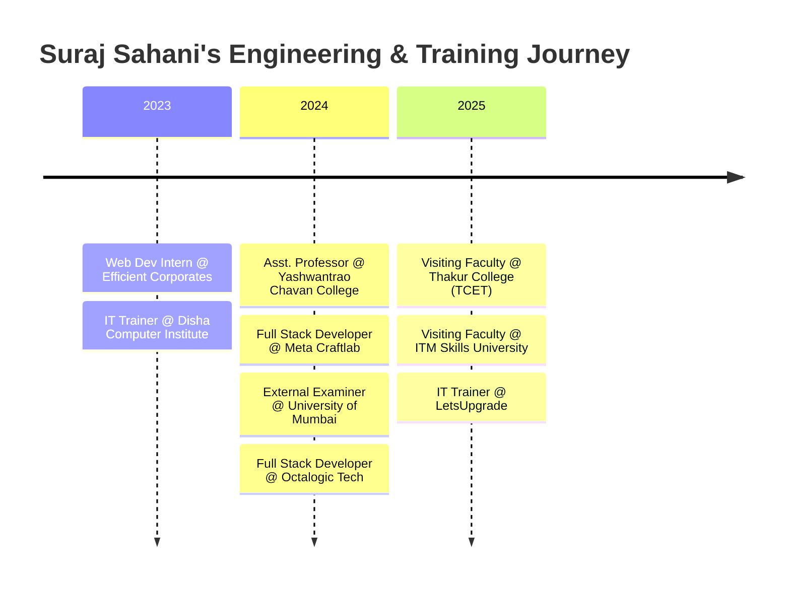

# <p align="center">👋 Hi, I'm Suraj Sahani</p>

<p align="center">
  <a href="https://engineersurajsahani.netlify.app/"></a>
</p>

<p align="center">
  <strong>🚀 Full Stack Software Engineer | 👨‍🏫 Tech Educator & Visiting Faculty | 🧠 Competitive Programmer | 🎥 Creator @ Elevate Coders</strong>
</p>

<p align="center">
  <a href="https://www.linkedin.com/in/engineersurajsahani/"></a>
  <a href="https://engineersurajsahani.netlify.app/"></a>
  <a href="https://github.com/engineersurajsahani"></a>
  <a href="https://www.youtube.com/@ElevateCoders"></a>
  <a href="mailto:techsurajsahani@gmail.com"></a>
  <a href="https://drive.google.com/file/d/19pP-1EWqRaepw1SLq5nG0IaE2ME82oLb/view?usp=sharing"></a>
</p>

---

## 🌟 Quick Snapshot

```yaml
Name: Suraj Sahani
Current Role: Full Stack Developer @ Octalogic Tech
Academic Roles: Visiting Faculty @ ITM Skills University & TCET Mumbai
Experience: 3+ Years (Full Stack Development, Corporate & Campus Training)
Community: 24,200+ LinkedIn Connections & Followers
DSA Track Record: 1,000+ Problems Solved (LeetCode 76k Rank | HackerRank 5-Star)
Mentorship: 1,000+ Students Trained Across Colleges & Institutes
Education: B.E. in Computer Engineering (8.68 CGPA) - Lokmanya Tilak College of Engg, Mumbai University
Location: Navi Mumbai, Maharashtra, India
```

---

## 👨‍💻 About Me

I am a passionate **Full Stack Software Engineer**, **EdTech Educator**, and **Problem Solver** with deep expertise across modern web ecosystems and high-performance backend architectures.

- 💼 **Industry Experience:** Currently engineering scalable, resilient web applications at **Octalogic Tech** using **React.js, Next.js, Node.js, NestJS, and PostgreSQL**.
- 🎓 **Faculty & Mentorship:** Visiting Faculty and Technical Trainer at prestigious institutions including **ITM Skills University**, **Thakur College of Engineering & Technology (TCET)**, **LetsUpgrade**, and **Disha Computer Institute**, having trained **1,000+ engineering graduates** in Full Stack Development, Spring Boot, MERN, Flutter, and DSA.
- 🏆 **Hackathons & Competitions:** First Prize Winner at **TECH TREK HACKATHON 2023**, Semifinalist in **Project Deep Blue (Season 7 - Mastek)**.
- 💡 **Problem Solving Passion:** Solved **1,000+ algorithmic challenges** across **LeetCode** (585+ C++, 305+ Java, 290+ Python, 290+ JS, 130+ TS) and **HackerRank** (5-Star badges in multiple domains).
- 🎥 **Content Creation:** Founder & Instructor at **Elevate Coders**, producing practical engineering tutorials on modern web stacks, DSA patterns, and AI tools.

---

## 🛠️ Technical Arsenal

<table>
  <tr>
    <th align="left">Category</th>
    <th align="left">Technologies & Frameworks</th>
  </tr>
  <tr>
    <td><strong>Core Languages</strong></td>
    <td>
      
      
      
      
      
      
      
      
      
    </td>
  </tr>
  <tr>
    <td><strong>Frontend Ecosystem</strong></td>
    <td>
      
      
      
      
      
      
      
      
      
      
      
    </td>
  </tr>
  <tr>
    <td><strong>Backend & Frameworks</strong></td>
    <td>
      
      
      
      
      
      
      
      
      
      
      
    </td>
  </tr>
  <tr>
    <td><strong>Databases & Cloud</strong></td>
    <td>
      
      
      
      
      
      
      
      
    </td>
  </tr>
  <tr>
    <td><strong>Developer Tools & Methods</strong></td>
    <td>
      
      
      
      
      
      
      
    </td>
  </tr>
</table>

---

## 💼 Professional Experience



### 💻 Industry Experience

#### 🔹 Full Stack Developer — [Octalogic Tech](https://www.octalogic.in/) *(Remote)*
> **Nov 2024 – Present**
- Architecting and developing production-ready web applications using **React.js, Next.js, Node.js, NestJS, and PostgreSQL**.
- Implementing secure RESTful APIs, JWT authentication, and TypeORM data layer integrations.
- Optimizing complex client frontend workflows and backend querying for peak performance.

#### 🔹 Full Stack Developer — Meta Craftlab Private Ltd. *(Remote)*
> **Jun 2024 – Sep 2024**
- Built modern reactive applications using **Svelte, SvelteKit, Flowbite Svelte, Node.js, and Tailwind CSS**.
- Engineered performant interactive components and responsive modular UI architectures.

#### 🔹 Web Application Developer Intern — Efficient Corporates Pvt. Ltd. *(Remote)*
> **Jun 2023 – Sep 2023**
- Engineered full stack web solutions using **Python, Django, PHP, Laravel, HTML/CSS, JavaScript, and jQuery**.
- Managed relational database design and CRUD workflows across **MySQL & SQLite3**.

---

### 🎓 Academic & Institutional Teaching Experience

#### 🔹 Visiting Faculty / Professor — [ITM Skills University (ITM Group)](https://www.itm.edu/)
> **May 2025 – Present | Kharghar, Navi Mumbai**
- **45 Sessions (23 Days) Backend Development Bootcamp (2nd Year B.Tech CSE):**
  - Delivered comprehensive hands-on backend training covering **JavaScript Fundamentals & Asynchronous Architecture, Node.js, Express.js, MongoDB, Supabase, Firebase / Firestore, Socket.io (Real-Time Apps), NestJS, PostgreSQL, TypeORM, and Docker**.
  - Guided students through **15 real-world industry API assignments** (Hotel Management, Hospital Management, E-Commerce, Multiplayer Tic-Tac-Toe, Real-Time Chat & Whiteboard, Live Bidding Platform, and Live Quiz APIs).
- **45 Sessions Flutter Mobile App Development (3rd Year B.Tech CSE):**
  - Delivered intensive training on **Flutter Cross-Platform Mobile Application Development** covering modern UI/UX design, state management, REST API integration, Firebase/Supabase backend connection, and production build deployment.
- **Comprehensive Project Evaluations (1st, 2nd & 3rd Year B.Tech CSE):**
  - Evaluated projects **multiple times** across cohorts:
    - **1st Year B.Tech CSE:** Evaluated Data Structures & Algorithms (DSA) console applications built in C++.
    - **2nd Year B.Tech CSE:** Evaluated full-stack web applications integrated with React.js, Node.js, Express.js, Docker, AWS, and REST APIs.
    - **3rd Year B.Tech CSE:** Evaluated advanced full-stack & mobile engineering capstone projects for architecture, code quality, and deployment readiness.

#### 🔹 Visiting Faculty / IT Trainer — [Thakur College of Engineering and Technology (TCET)](https://www.tcetmumbai.in/)
> **Jan 2025 – Present | Kandivali, Mumbai**
- **Full Stack Java Development Training (Second Year & Third Year Engineering Students):**
  - Conducting comprehensive **Full Stack Java Development** training programs for **Second Year (SE) and Third Year (TE)** Computer Engineering and E&TC candidates.
  - Topics covered: **Core Java, OOPs, JDBC, JdbcTemplate, Spring Framework, Spring Boot, JPA, Hibernate, REST API Development, JWT Authentication & Authorization, and React.js frontend integration**.
- **Spring Boot & Full Stack Development Bootcamp (Final Year Students):**
  - Delivered intensive weekend bootcamps taking students from fundamental architecture (IoC, DI) to full-stack production-grade deployment with React.js.
- **9-Hour Marathon DSA Session:**
  - Mentored students on high-frequency LeetCode algorithmic patterns (**Trees, BSTs, DP, Recursion, HashMaps, Backtracking, Stack & Queue implementations**).
- **Industry Practices (IP) Workshops:**
  - Delivered hands-on workshops on **JavaScript, React.js, Node.js, Express.js, and MongoDB**.

#### 🔹 Assistant Professor (CS & IT Dept) — Yashwantrao Chavan College
> **Jan 2024 – Mar 2025 | Koparkhairane, Navi Mumbai**
- Taught core university curriculum: **Web Application Development, OOP in C++, Core & Advanced Java, Data Structures & Algorithms, DBMS, Operating Systems, and DAA**.

#### 🔹 External Examiner — [University of Mumbai](https://mu.ac.in/)
> **Jan 2024 – Apr 2025 | Mumbai**
- Appointed External Examiner for **Cloud Computing, Web Services, IoT, and Final Year Projects** at top colleges including **Sanpada College (SCCT), SIES College, N.G. Acharya & Marathe College, and Rajiv Gandhi College**.

#### 🔹 IT Trainer — [LetsUpgrade](https://letsupgrade.in/) & [Disha Computer Institute](https://dishakotak.com/)
> **Sep 2023 – Present**
- Mentored **1,000+ candidates** with a **90% course completion rate** across **C, C++, Java, Python, MERN Stack, and SQL**.

---

## 🚀 Featured Projects

<table>
  <tr>
    <td width="50%">
      <h3 align="center">📚 Computer Engineering Education Portal</h3>
      <p align="center">
        
        
        
      </p>
      <p>Comprehensive educational portal built for engineering students to access subject syllabus, notes, assignments, and exam resources with dedicated admin portal.</p>
      <p align="center">
        <a href="https://techsurajsahani.pythonanywhere.com/">🌐 <strong>Live User Portal</strong></a> |
        <a href="https://techsurajsahani.pythonanywhere.com/admin/login/?next=/admin/">⚙️ <strong>Admin Panel</strong></a>
      </p>
    </td>
    <td width="50%">
      <h3 align="center">💍 Love & Lace — Wedding Planner</h3>
      <p align="center">
        
        
        
      </p>
      <p>Dynamic event management & wedding planning platform featuring venue booking, vendor management, guest checklists, budget tracking, and admin dashboard.</p>
      <p align="center">
        <a href="https://surajsahaniloveandlace.pythonanywhere.com/">🌐 <strong>Live User Portal</strong></a> |
        <a href="https://surajsahaniloveandlace.pythonanywhere.com/admin/login/?next=/admin/">⚙️ <strong>Admin Panel</strong></a>
      </p>
    </td>
  </tr>
  <tr>
    <td width="50%">
      <h3 align="center">🎥 YouTube Clone (React.js)</h3>
      <p align="center">
        
        
        
      </p>
      <p>Modern video streaming interface featuring video playback, categorized feeds, search functionality, dynamic channel exploration, and responsive UI design.</p>
      <p align="center">
        <a href="https://surajsahani-youtube.netlify.app/">🌐 <strong>Live Demo</strong></a>
      </p>
    </td>
    <td width="50%">
      <h3 align="center">📖 E-Granthalaya & Library Management</h3>
      <p align="center">
        
        
        
      </p>
      <p>End-to-end digital library cataloging system with book issue/return tracking, fine calculation, user auth, search filters, and inventory analytics.</p>
      <p align="center">
        <a href="https://surajsahaniprogrammer.pythonanywhere.com/login?next=/">🌐 <strong>Live Portal</strong></a> |
        <a href="https://surajsahanidjangodeveloper.pythonanywhere.com/">📖 <strong>Library System</strong></a>
      </p>
    </td>
  </tr>
  <tr>
    <td width="50%">
      <h3 align="center">🤖 AI Conversational Assistant</h3>
      <p align="center">
        
        
        
      </p>
      <p>Interactive AI chat interface featuring streaming conversational intelligence, markdown rendering, responsive bubble chat, and history handling.</p>
      <p align="center">
        <a href="https://surajsahani-ai-chatbot.netlify.app/">🌐 <strong>Live Demo</strong></a>
      </p>
    </td>
    <td width="50%">
      <h3 align="center">📝 TextUtils Text Processing Tool</h3>
      <p align="center">
        
        
        
      </p>
      <p>Feature-rich utility web application for text manipulation: case conversion, space removal, reading time calculation, word & character counts, copy-to-clipboard.</p>
      <p align="center">
        <a href="https://surajsahani-textutils.netlify.app/">🌐 <strong>Live Demo</strong></a>
      </p>
    </td>
  </tr>
  <tr>
    <td width="50%">
      <h3 align="center">👥 Employee Management CRUD</h3>
      <p align="center">
        
        
        
      </p>
      <p>Clean CRUD portal with multi-attribute filtering, pagination, form validation, role management, and database synchronization.</p>
      <p align="center">
        <a href="http://surajsahani-employee-crud.infinityfreeapp.com/php-mysqli-employee-crud-app/index.php">🌐 <strong>Live Demo</strong></a>
      </p>
    </td>
    <td width="50%">
      <h3 align="center">📝 Dynamic Blog Web Application</h3>
      <p align="center">
        
        
        
      </p>
      <p>Blogging platform supporting rich-text authoring, categories, tags, user comments, author profiles, and an administrative moderation panel.</p>
      <p align="center">
        <a href="https://surajsahani.pythonanywhere.com/home/">🌐 <strong>Live Portal</strong></a> |
        <a href="https://surajsahani.pythonanywhere.com/admin/login/?next=/admin/">⚙️ <strong>Admin Panel</strong></a>
      </p>
    </td>
  </tr>
</table>

<details>
  <summary>🎮 <strong>Click here to view Mini Projects & Interactive Web Utilities</strong></summary>
  <br/>
  <table>
    <tr>
      <td><a href="https://surajsahani-calculator.netlify.app/">🧮 <strong>Simple Calculator</strong></a></td>
      <td><a href="https://surajsahani-agecalculator.netlify.app/">📅 <strong>Age Calculator</strong></a></td>
      <td><a href="https://surajsahani-musicplayer.netlify.app/">🎵 <strong>Music Player</strong></a></td>
      <td><a href="https://surajsahani-digitalclock.netlify.app/">⏰ <strong>Digital Clock</strong></a></td>
    </tr>
    <tr>
      <td><a href="https://surajsahani-time-calculator.netlify.app/">⏳ <strong>Time Calculator</strong></a></td>
      <td><a href="https://surajsahani-number-system-converter.netlify.app/">🔢 <strong>Number System Converter</strong></a></td>
      <td><a href="https://surajsahani-image-slider.netlify.app/">🖼️ <strong>Image Slider</strong></a></td>
      <td><a href="https://surajsahani-tic-tac-toe-game.netlify.app/">❌⭕ <strong>Tic-Tac-Toe Game</strong></a></td>
    </tr>
  </table>
</details>

---

## 🧠 Competitive Programming & DSA Stats

<div align="center">
  <table>
    <tr>
      <td align="center" width="50%">
        <h3>🔥 LeetCode Metrics</h3>
        <p><strong>Rank: Top 76,500 | 6.9K+ Profile Views</strong></p>
        <p>
          
          
        </p>
        <p>
          
          
        </p>
        <p>
          
          
        </p>
      </td>
      <td align="center" width="50%">
        <h3>⭐ HackerRank 5-Star Badges</h3>
        <p>
          
          
        </p>
        <p>
          
          
        </p>
        <p>
          
          
        </p>
      </td>
    </tr>
  </table>
</div>

---

## 🏆 Key Achievements & Hackathons

- 🥇 **1st Prize Winner — TECH TREK HACKATHON 2023:** Built a high-performance, real-time application in a 24-hour sprint.
- 🥈 **Semifinalist — Project Deep Blue Season 7 (Mastek):** Engineered an AI/ML-driven solution solving real-world social impact challenges.
- 🎓 **Student of the Year & Best Student Award:** Awarded for stellar academic excellence and leadership at Jijamata Secondary Convent School.
- 🎖️ **LinkedIn Skill Badges:** Verified in C, C++, Java, Python, JavaScript, React.js, Node.js, Spring Framework, PHP, MySQL, MongoDB, and Git.
- 👥 **Community Speaker:** Keynote Speaker at **Lokmanya Tilak College of Engineering (LTCE)** and **Sanpada College (SCCT)** on *Internship Readiness, Modern Tech Stacks in 2026, and Developer Productivity with AI*.

---

## 📜 Selected Certifications

<details>
  <summary>🎓 <strong>Click to view certifications & verified credentials (40+ Verified Badges)</strong></summary>
  <br/>
  
  - 🏅 **IBM SkillsBuild / CSRBOX:** Web Development Fundamentals Badge & Internship Plan
  - 🏅 **Coding Ninjas:** OOPs in C++, Basics of Node.js, Fundamentals of React Native, Basics of Java, Basics of Angular, Basics of React.js, Fundamentals of CSS, HTML, JavaScript & Python
  - 🏅 **freeCodeCamp:** JavaScript Algorithms and Data Structures
  - 🏅 **Simplilearn:** Full Stack Java Development (Spring Boot, Hibernate, REST APIs), Java Certification, Python Libraries for Data Science, PHP
  - 🏅 **HackerRank Certified:** Problem Solving (Intermediate & Basic), SQL (Intermediate & Basic), Python, JavaScript, React.js, Angular, C#
  - 🏅 **Great Learning:** Face Detection & Face Recognition with OpenCV, NLP Projects, Intro to AI, Master Data Science in Python, Python MySQL, React.js, Django, Advanced SQL
  - 🏅 **MindLuster:** Laravel From Scratch, Python GUI
  - 🏅 **CodeChef:** Python Programming Certification
  - 🏅 **LetsUpgrade Bootcamps:** Java, React.js, JavaScript, Python, HTML & CSS Essentials
</details>

---

## 🎓 Education Background

<table>
  <tr>
    <th>Degree / Level</th>
    <th>Institution & Board</th>
    <th>Year</th>
    <th>Score / Distinction</th>
  </tr>
  <tr>
    <td><strong>B.E. in Computer Engineering</strong></td>
    <td>Lokmanya Tilak College of Engineering, University of Mumbai</td>
    <td>2020 – 2024</td>
    <td><strong>8.68 CGPA (First Class with Distinction)</strong></td>
  </tr>
  <tr>
    <td><strong>H.S.C. (Class XII - Science with IT)</strong></td>
    <td>Allen Swami Vivekanand Junior College of Science (MSBSHSE)</td>
    <td>2018 – 2020</td>
    <td><strong>87%</strong> (MHTCET PCM: 91%ile | PCB: 99%ile)</td>
  </tr>
  <tr>
    <td><strong>S.S.C. (Class X)</strong></td>
    <td>Jijamata Secondary Convent School (MSBSHSE)</td>
    <td>2008 – 2018</td>
    <td><strong>91%</strong> (Student of the Year Award)</td>
  </tr>
</table>

---

## 📊 GitHub Analytics & Activity

<div align="center">
  <a href="https://github.com/engineersurajsahani">
    
    
  </a>
</div>

<div align="center">
  <a href="https://github.com/engineersurajsahani">
    
  </a>
</div>

---

## 🤝 Let's Connect & Collaborate

I am always excited to discuss full stack engineering opportunities, scalable software architectures, corporate & campus training programs, and collaborative open-source projects!

<p align="center">
  <a href="https://www.linkedin.com/in/engineersurajsahani/"></a>
  <a href="https://github.com/engineersurajsahani"></a>
  <a href="https://engineersurajsahani.netlify.app/"></a>
  <a href="https://www.youtube.com/@ElevateCoders"></a>
  <a href="https://www.instagram.com/engineersurajsahani/"></a>
  <a href="mailto:techsurajsahani@gmail.com"></a>
</p>

<p align="center">
  <strong>📍 Location:</strong> Koparkhairane, Navi Mumbai, Maharashtra, India<br/>
  <strong>📞 Phone:</strong> <a href="tel:+919321887200">+91 9321887200</a> | <strong>📧 Email:</strong> <a href="mailto:techsurajsahani@gmail.com">techsurajsahani@gmail.com</a>
</p>

---

<div align="center">
  <blockquote>
    <em>"Success doesn't come from solving one difficult problem. It comes from showing up every day, practicing consistently, and refusing to quit when things get challenging."</em>
  </blockquote>
  
  <br/><br/>
  <sub>Designed with ❤️ by <a href="https://github.com/engineersurajsahani"><strong>Suraj Sahani</strong></a></sub>
</div>
